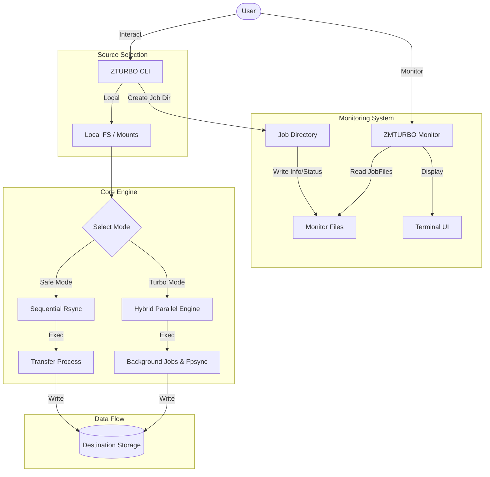
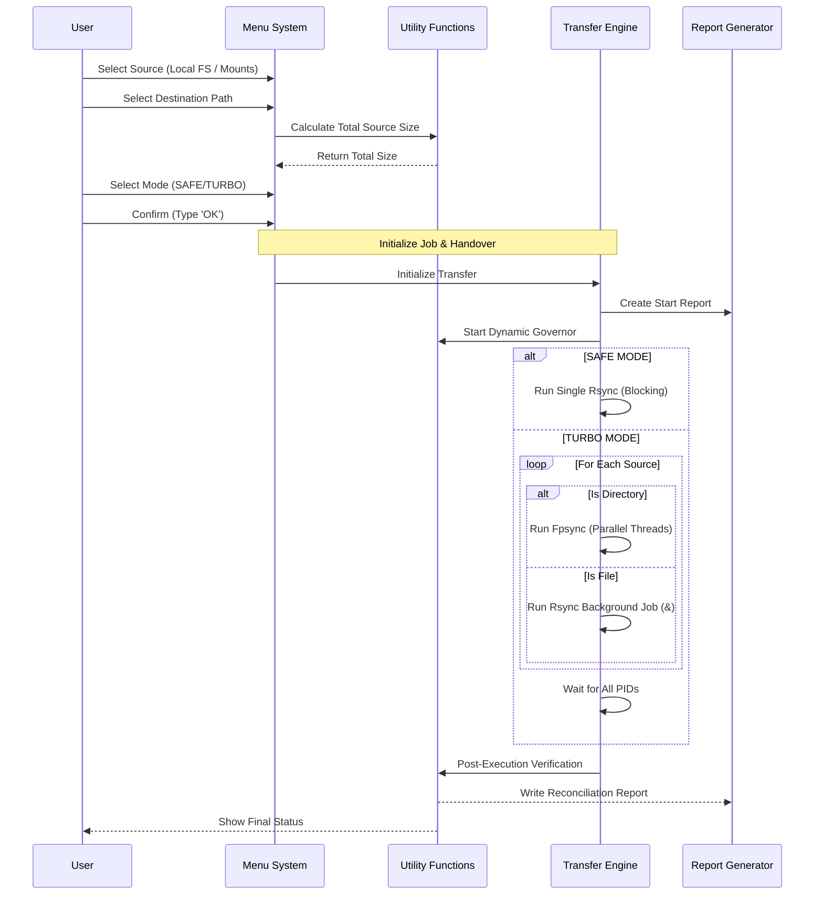
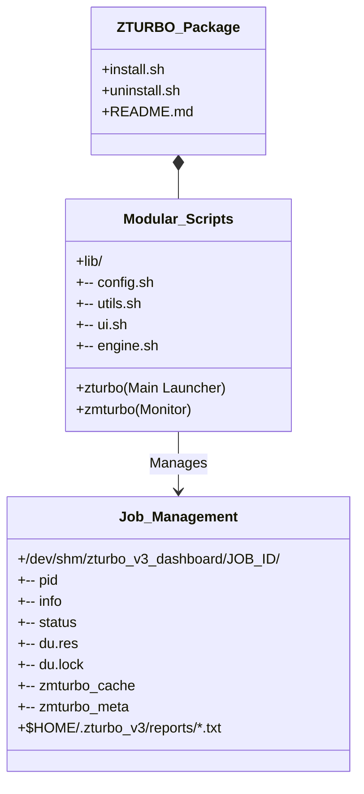

# ZTURBO Architecture Blueprint (V1.3.5 Modular & Refined)

## 1. High-Level Overview

ZTURBO is a modular shell-based application that leverages native Linux tools (`rsync`, `fpsync`, `du`, `find`) for high-performance data transfers. It now features a robust asynchronous `du`-based monitoring system for real-time progress updates.

## 2. Transfer Execution Flow (Main Logic)

The core logic of `zturbo` handles user input, path selection, and mode switching before initiating the actual data movement.

## 4. Directory Structure & Components

